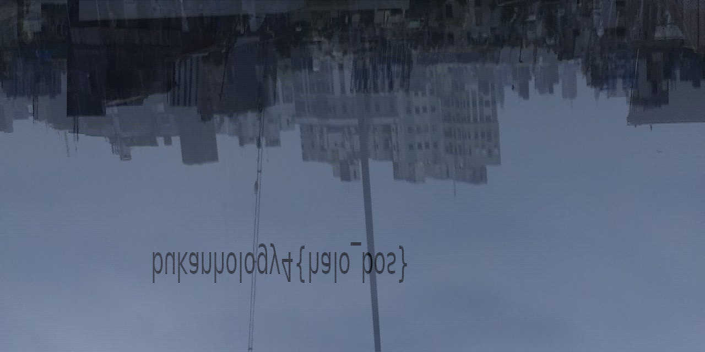
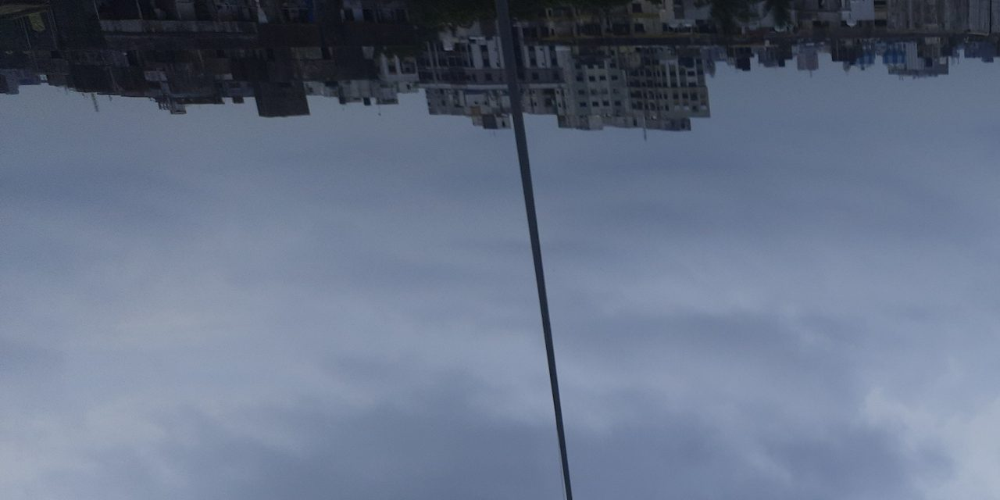
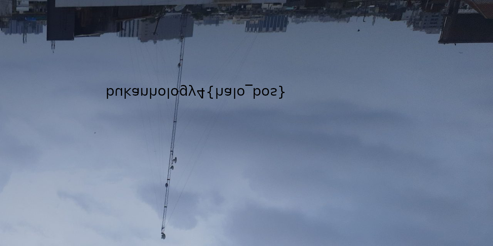
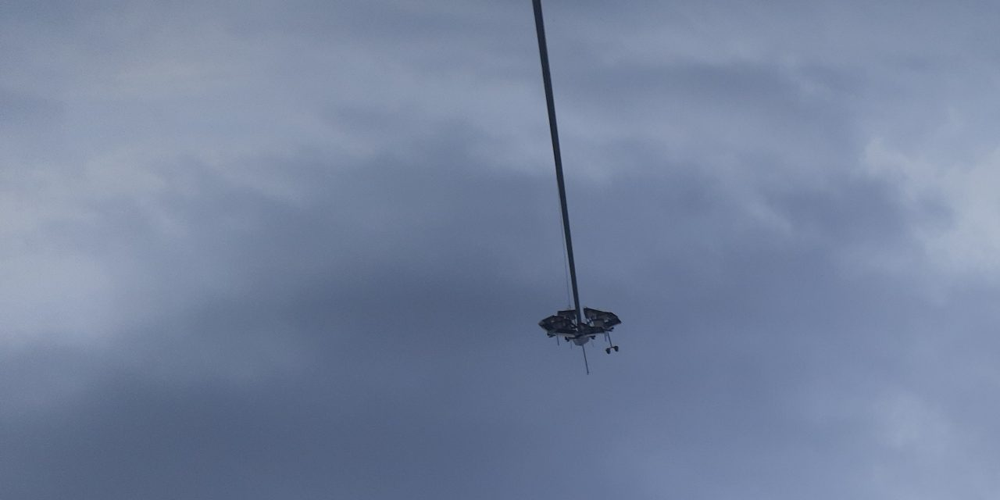
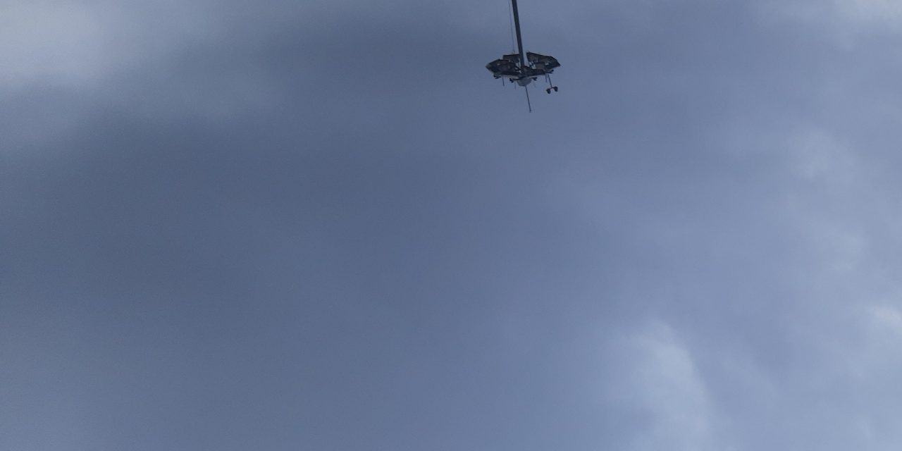
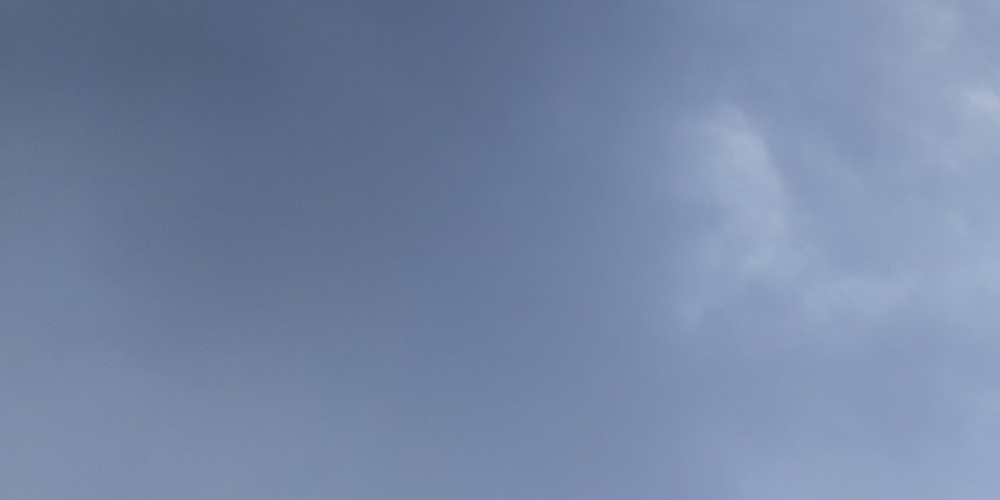
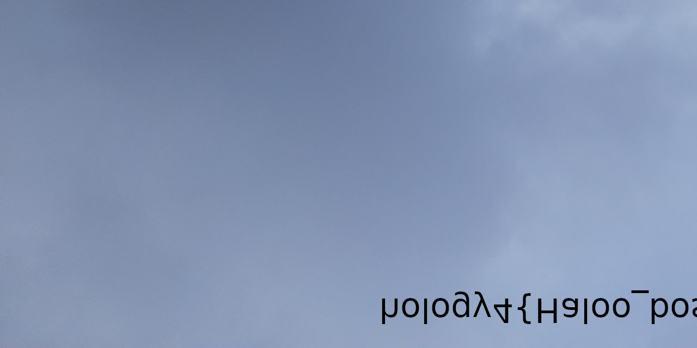
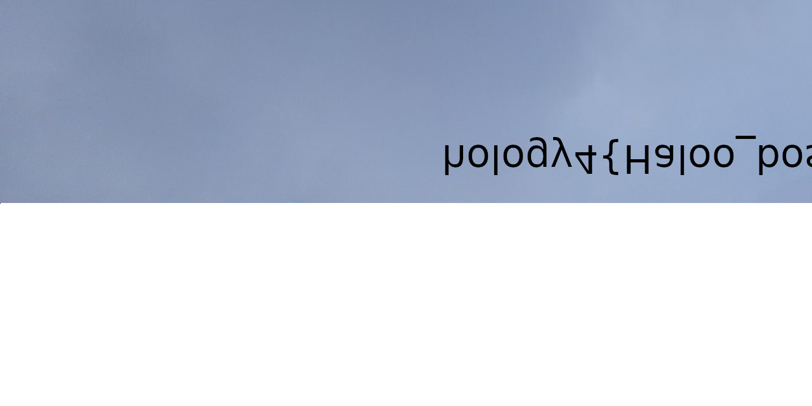
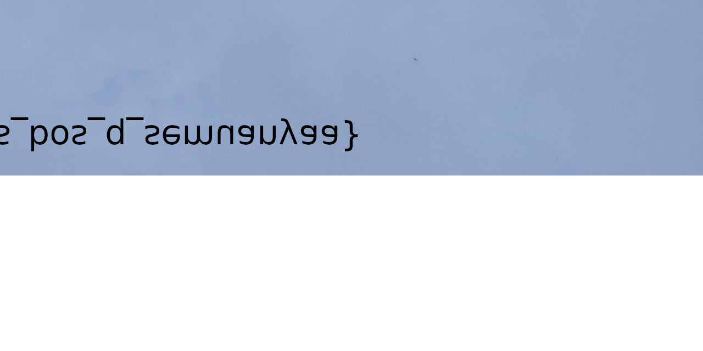

# Silinder

  
  


## Description
BMP Forensic, with additional image trailing, and stride image.

## Attached files
solve.java
```java
public static void main(String[] args) throws Exception {
    File f = new File("raw");
    FileInputStream fis = new FileInputStream(f);
    long l = f.length();
    int w = 1280;
    int h = 640;
    int p = (int) (l / 4); // BGRA
    System.out.println("width: " + w);
    System.out.println("height: " + h);
    System.out.println("all: " + w*h);
    System.out.println("p: " + p);

    // SEE DETAILED SOLUTIONS BELOW, THERE ARE MULTIPLE OUTPUT, INPUT THOSE LINES AFTER THIS

    int[] bands = new int[] { 3, 2, 1, 0 };
    SampleModel sampleModel = new ComponentSampleModel(DataBuffer.TYPE_BYTE, w, h, bands.length, w * bands.length, bands);
    WritableRaster raster = Raster.createWritableRaster(sampleModel, new DataBufferByte(pixels, w * h * bands.length), null);
    ColorModel colorModel = new ComponentColorModel(ColorSpace.getInstance(ColorSpace.CS_sRGB), true, false, Transparency.TRANSLUCENT, DataBuffer.TYPE_BYTE);
    BufferedImage result = new BufferedImage(colorModel, raster, colorModel.isAlphaPremultiplied(), null);
    
    ImageIO.write(result, "PNG", new File("out.png"));
}
```

## Summary
Comes with broken bmp file, there were still image data intact. Then after recovered, there were spotted trailing image data, which does not satisfy the expected image size. Further image width and height analysis from the original file and manual analysis were required.


## Flag
```
hology4{Haloo_bos_bos_q_semuanyaa}
```

## Detailed solution
1. Analysis the header of BMP, some info may be useful later. (image width, image height, bit masks)
2. Later discovered, it was taking too long to recover the header. Then, decided to extract the raw data instead, since the header is just a standard header.
3. Export multiple version of images
- The exported `rawimage.png`
```java
byte[] pixels = new byte[w*h*4];
for(int i = 0; i < h; i++) {
    fis.read(pixels, i * w * 4, w * 4);
}
```

From the resulted image, I could conclude that what I was seeing was two images, but merged into one with alternating scanline, (I call this stride for now).
- The exported `rawimagestride0.png`
```java
byte[] pixels = new byte[w*h*4];
for(int i = 0; i < h; i++) {
    fis.read(pixels, i * w * 4, w * 4);
    fis.skip(w * 4);
}
```

- The exported `rawimagestride1.png`, contains fake flag
```java
byte[] pixels = new byte[w*h*4];
for(int i = 0; i < h; i++) {
    fis.skip(w * 4);
    fis.read(pixels, i * w * 4, w * 4);
}
```

- The exported `skip{n}.png`, uncomment each line
```java
byte[] pixels = new byte[w*h*4];
fis.skip(pixels.length); // skip1.png
// fis.skip(pixels.length); // skip2.png
// fis.skip(pixels.length); // skip3.png
// fis.skip(pixels.length); // skip4.png
// fis.skip(pixels.length); // skip5.png
for(int i = 0; i < h; i++) {
    fis.read(pixels, i * w * 4, w * 4);
    fis.skip(w * 4);
}
```
| | | |
|--|--|--|
||||
|||
* The exported `skip5stride1.png`, note that the file actually contains two strides.
```java
byte[] pixels = new byte[w*h*4];
fis.skip(pixels.length);
fis.skip(pixels.length);
fis.skip(pixels.length);
fis.skip(pixels.length);
fis.skip(pixels.length);
for(int i = 0; i < h; i++) {
    fis.skip(w * 4);
    fis.read(pixels, i * w * 4, w * 4);
}
```

4. Flag was found on the `skip4.png` and `skip5stride1.png`

## Another solutions
I haven't thought about other solutions, but I do think that manual file repairing is possible, it'll just take ages though. Yet my solution wasn't perfect either, there were still gaps between `skip4.png` and `skip5stride1.png`, and I had to take a guess the letters between them.